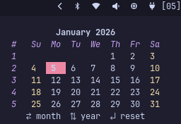

# Zen-Cal

A minimal, interactive terminal-based calendar built in **Go**, with month and year navigation using vim-style or arrow keys.

<div style="display: flex; gap: 12px;">
  
  
</div>


## Configuration

Zen-Cal can be customized to match your theme. The following defaults work well with most dark themes:

```toml
primary   = #3f51b5  
secondary = #f1f1f1 
text      = #ffffff 
alert     = #ff4081
```

You can adjust these values to match your preferred color scheme in `~/.config/zen-cal/zen-cal.config`.


## Controls

| Key                  | Action         |
| -------------------- | -------------- |
| `h`, `←`             | Previous month |
| `l`, `→`             | Next month     |
| `k`, `↑`             | Previous year  |
| `j`, `↓`             | Next year      |
| `r`, `↵`             | Reset to today |
| `q`, `Ctrl+C`, `esc` | Quit           |

## Requirements

* Go 1.20 or higher
* UTF-8 compatible terminal

## Installation
> **Note:** The installer updates your Waybar configuration directly but first creates a backup to restore on uninstall, make sure to keep a copy of your config in case recovery is needed.

```bash
git clone https://github.com/beaterblank/zen-cal.git
cd zen-cal
chmod +x ./install.sh
./install.sh
```

## Uninstallation

```bash
chmod +x ./uninstall.sh ./purge.sh
./uninstall.sh
# optionally, remove all files using purge.sh
```


## Dependencies

* hyprland
* Waybar
* go lang
* jq (installation dependency)
* `github.com/charmbracelet/bubbletea`
* `github.com/charmbracelet/lipgloss`
