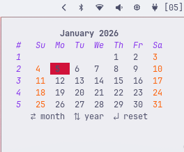

# Zen-Cal

- A minimal, interactive terminal-based calendar built in **Go** using
[Bubble Tea](https://github.com/charmbracelet/bubbletea) and
[Lip Gloss](https://github.com/charmbracelet/lipgloss).

- Terminal UI calendar with navigation months and years with vim-style keys



## Controls

| Key            | Action         |
| -------------- | -------------- |
| `h`            | Previous month |
| `l`            | Next month     |
| `k`            | Previous year  |
| `j`            | Next year      |
| `r`            | Reset to today |
| `q` / `Ctrl+C` | Quit           |

## Requirements
* Go 1.20+
* Terminal with UTF-8 support

## Installation
```bash
git clone https://github.com/yourusername/terminal-calendar.git
cd terminal-calendar
go mod tidy
go run .
```

## Dependencies

* `github.com/charmbracelet/bubbletea`
* `github.com/charmbracelet/lipgloss`
* `github.com/charmbracelet/lipgloss/table`
